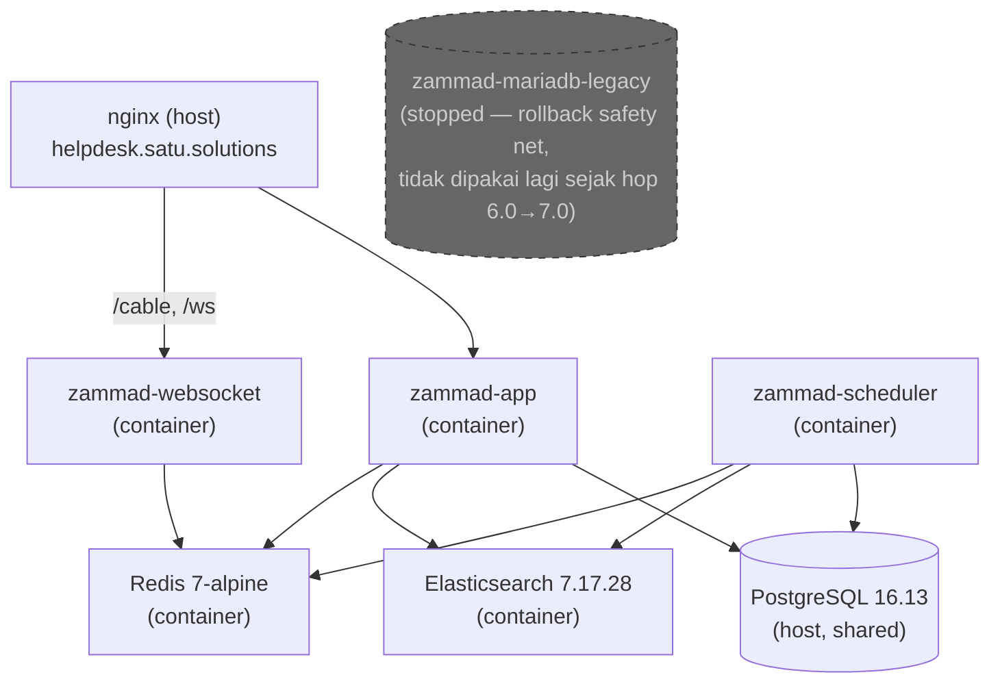
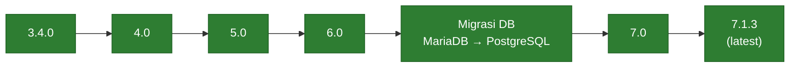

# Zammad Upgrade Project — 3.4.0 → 7.1.3 (latest)

> **Untuk pengunjung baru:** ini **log teknis pribadi/internal** dari satu proyek
> riset upgrade Zammad tertentu, dibagikan sebagai referensi — **bukan panduan umum**
> yang dijamin berlaku untuk instance Zammad lain. Banyak detail di sini spesifik ke
> satu server tertentu (keterbatasan disk, resource dibagi banyak layanan lain) yang
> mungkin tidak relevan di lingkungan Anda — jangan diterapkan mentah-mentah tanpa
> disesuaikan. Konten dibagikan apa adanya untuk referensi, **tanpa lisensi untuk
> digunakan ulang** (bukan open-source) — lihat [LICENSE](LICENSE) untuk ketentuan
> lengkapnya.

**Status: ✅ Playbook upgrade 3.4.0 → 7.1.3 SELESAI & TERVALIDASI SEPENUHNYA di
sandbox riset** (seluruh 4 hop + migrasi database, lihat tabel Status di bawah).
Sandbox ini terpisah dari produksi nyata (lihat [§ Konteks](#konteks)). **Kesiapan produksi juga
sudah ditangani** — lihat [PRODUCTION_READINESS_TODO.md](PRODUCTION_READINESS_TODO.md)
(gap analysis, 9/9 kategori selesai) dan [CUTOVER_CHECKLIST.md](CUTOVER_CHECKLIST.md)
(checklist eksekusi saat playbook ini benar-benar diterapkan ke produksi nyata nanti).

**Dikelola oleh:** [alidjator](https://github.com/alidjator) — pertanyaan lewat
alidjator@gmail.com atau [issue di repo ini](https://github.com/alidjator/zammad-upgrade-docs/issues).

📦 **Status proyek: ARSIP** — seluruh playbook riset ini final per 15 Sept 2026,
tidak ada rencana update konten baru kecuali muncul temuan baru saat playbook ini
benar-benar diterapkan ke produksi nyata nanti (lihat
[CUTOVER_CHECKLIST.md](CUTOVER_CHECKLIST.md)).

## Daftar isi

- [Tutorial (orientasi ~10 menit)](#tutorial-orientasi-10-menit)
- [Peta dokumen](#peta-dokumen)
- [Skill set yang dibutuhkan](#skill-set-yang-dibutuhkan)
- [Konteks](#konteks)
- [Arsitektur](#arsitektur)
- [Lokasi kerja di server](#lokasi-kerja-di-server)
- [Roadmap upgrade](#roadmap-upgrade)
- [Status](#status)
- [Penanda milestone (git tag)](#penanda-milestone-git-tag)
- [Kesiapan produksi](#kesiapan-produksi---selesai-99-kategori)
- [TODO — polish dokumentasi](#todo--polish-dokumentasi-setelah-hop-713-selesai--tervalidasi---selesai)
- [Catatan keamanan](#catatan-keamanan)

## Tutorial (orientasi ~10 menit)

Baru pertama kali buka repo ini (termasuk jika ini "diri sendiri di masa depan" yang
lupa detailnya)? Urutan baca yang disarankan:

1. **Konteks** (di bawah) — pahami dulu ini sandbox riset, bukan produksi nyata.
2. **Status** (tabel di bawah) — lihat hop mana yang sudah selesai, cek link ke
   `NOTES.md` (insiden nyata + fix), `CHANGELOG.md` (perubahan skema/environment),
   `RUNBOOK.md` (langkah eksekusi tervalidasi) untuk hop yang menarik.
3. **[ROADMAP.md](ROADMAP.md)** — matriks requirement per versi + pelajaran operasional
   lintas-hop (index ES stale, kejutan versi dependency, dsb).
4. **[DOWNTIME_ESTIMATE.md](DOWNTIME_ESTIMATE.md)** — jika butuh angka durasi nyata
   untuk perencanaan.
5. Mau eksekusi ulang salah satu hop? Buka `hop-X-to-Y/RUNBOOK.md` langsung — sudah
   berisi langkah final yang terbukti berhasil, tidak perlu baca `NOTES.md` dulu
   kecuali ingin tahu detail insiden di baliknya.
6. Mau menerapkan ke produksi nyata? Baca
   **[PRODUCTION_READINESS_TODO.md](PRODUCTION_READINESS_TODO.md)** dan
   **[CUTOVER_CHECKLIST.md](CUTOVER_CHECKLIST.md)** dulu sebelum RUNBOOK per hop.
7. Nemu istilah yang tidak familiar? Cek **[GLOSSARY.md](GLOSSARY.md)**. Mau tahu
   apakah suatu error pernah terjadi sebelumnya? Cek
   **[INCIDENT_INDEX.md](INCIDENT_INDEX.md)** — indeks semua insiden lintas-hop.

## Peta dokumen

**Root (lintas-hop):**

| File | Isi |
|---|---|
| `README.md` (dokumen ini) | Entry point, konteks, roadmap, status |
| [`ROADMAP.md`](ROADMAP.md) | Matriks requirement per hop + pelajaran operasional lintas-hop |
| [`DOWNTIME_ESTIMATE.md`](DOWNTIME_ESTIMATE.md) | Angka durasi nyata per hop untuk perencanaan maintenance window |
| [`CUTOVER_CHECKLIST.md`](CUTOVER_CHECKLIST.md) | Checklist eksekusi saat playbook diterapkan ke produksi nyata |
| [`BACKUP_RESTORE.md`](BACKUP_RESTORE.md) | Referensi cepat darurat backup/restore |
| [`PRODUCTION_READINESS_TODO.md`](PRODUCTION_READINESS_TODO.md) | Gap analysis kesiapan produksi (histori — sudah 9/9 selesai) |
| [`INCIDENT_INDEX.md`](INCIDENT_INDEX.md) | Indeks semua insiden lintas-hop untuk lookup cepat |
| [`GLOSSARY.md`](GLOSSARY.md) | Istilah teknis yang dipakai berulang di seluruh dokumentasi |
| [`LICENSE`](LICENSE) | Ketentuan penggunaan konten repo ini |

**Per hop (folder `hop-X-to-Y/`, sama pola di tiap folder):**

| File | Isi |
|---|---|
| `NOTES.md` | Catatan lengkap: insiden nyata yang ditemukan + fix-nya, kronologis |
| `CHANGELOG.md` | Perubahan versi/skema (format [Keep a Changelog](https://keepachangelog.com)) |
| `RUNBOOK.md` | Langkah eksekusi final tervalidasi — dipakai untuk mengulang hop ini |

`postgres-migration/` mengikuti pola yang sama (`NOTES.md`, `RUNBOOK.md`) tanpa
`CHANGELOG.md` karena ini migrasi database, bukan upgrade versi aplikasi.

## Skill set yang dibutuhkan

Bukan checklist formal — ini kemampuan yang **benar-benar terpakai** selama proses hop
1-3 dan migrasi database, berdasarkan insiden nyata yang tercatat di tiap `NOTES.md`:

- **Docker & Docker Compose** — build image, debug networking antar-container (bridge
  network, `extra_hosts`/`host.docker.internal`), baca `docker compose logs`, kelola volume
- **Command line Linux** — bash dasar, `sed` untuk edit file, `systemctl`/`firewalld`,
  monitoring disk (`df`, `du`, `docker system df`) — disk penuh terjadi berkali-kali
- **Baca stack trace Ruby/Rails** — beberapa bug (mis. hop 5.0→6.0's BigDecimal issue)
  cuma bisa ditemukan akar masalahnya dengan menelusuri backtrace sampai ke kode
  ActiveRecord/gem, bukan cuma baca pesan error baris pertama
- **Administrasi database dasar** — SQL basic, beda konsep MySQL/MariaDB vs PostgreSQL,
  backup/restore (`mysqldump`, `pgloader`), grant/privilege user, **selalu verifikasi
  integritas backup** (jangan asumsikan selesai = valid)
- **Konsep dasar Elasticsearch** — cluster health, disk watermark, index lifecycle
  (drop/create/reload) — bukan expertise ES penuh, tapi cukup untuk diagnosa block/error umum
- **Git** dasar (commit, push) — dan kedisiplinan tidak commit credential asli
- **Kesabaran & pola pikir sistematis** — beberapa masalah (versi-gap MariaDB) butuh
  pivot strategi besar, bukan cuma tambal-sulam satu bug demi satu bug. Kemampuan
  mengenali kapan "tambal lagi" sudah tidak masuk akal dan perlu pendekatan berbeda
  itu lebih penting daripada hafal solusi teknis spesifik.

**Yang TIDAK wajib:** expertise mendalam di Ruby/Rails internals atau tuning ES
production-grade — sejauh ini cukup dengan riset terarah (baca source code Zammad/gem
di GitHub, cross-check dengan dokumentasi resmi) saat menemukan bug baru.

## Konteks

⚠️ **PENTING — koreksi framing (15 Sept 2026):** Seluruh environment di server
`Koi-Server-Dev` (baik `zammad-audit` maupun `zammad-staging`) adalah **mesin
riset/simulasi untuk merehearsal proses upgrade**, **TIDAK terhubung sama sekali**
dengan environment produksi nyata (yang berjalan di infrastruktur terpisah, tidak
dikelola lewat proyek dokumentasi ini). Data yang dipakai di sini adalah **snapshot
data produksi yang diambil di suatu titik waktu** (bukan trafik pelanggan langsung) —
data produksi asli terus bertambah secara independen dan kemungkinan besar sudah lebih
banyak dari snapshot yang dipakai di sini saat ini. Kalimat-kalimat di bawah yang
menyebut "produksi" merujuk ke **peran simulasi domain/stack di dalam sandbox riset
ini**, bukan sistem produksi sungguhan.

**Tujuan proyek ini:** memvalidasi dan mendokumentasikan **playbook upgrade** (RUNBOOK
per hop) sampai terbukti berhasil dieksekusi ulang secara konsisten, supaya siap
diterapkan ke environment produksi nyata nanti — dengan data produksi yang sudah
diperbarui saat itu, bukan snapshot yang dipakai di sandbox ini.

Self-hosted Zammad simulasi di server `Koi-Server-Dev` (CentOS Stream 9), berjalan via
Docker Compose custom (bukan install native, bukan image resmi Zammad). Domain yang
dipakai untuk simulasi: `helpdesk.satu.solutions` (reverse proxy nginx, SSL Let's
Encrypt sudah ada) — domain ini bagian dari sandbox riset, bukan endpoint yang
menerima trafik pelanggan produksi nyata.

**Selama proses upgrade ini berlangsung, domain simulasi sengaja diarahkan ke
environment staging.** Stack "produksi" simulasi (project Docker Compose `zammad-audit`
di `/usr/local/src/zammad-audit`) dimatikan sementara untuk membebaskan resource
server — ini juga bagian dari sandbox, bukan sistem produksi sungguhan. Keputusan ini
awalnya reaksi darurat (server berbagi RAM 7,5GB dengan banyak layanan lain, sempat
membuat stack "produksi" simulasi error 500 karena tekanan memori saat 2 stack Zammad
jalan bersamaan), bukan cuma keputusan proaktif — kronologi lengkap di
[hop-3.4.0-to-4.0/NOTES.md § "Insiden operasional selama proses
ini"](hop-3.4.0-to-4.0/NOTES.md#insiden-operasional-selama-proses-ini).

## Arsitektur

**Penamaan resource** (3 nama mirip yang gampang tertukar):

| Nama | Apa itu |
|---|---|
| `zammad-staging` | Nama project Docker Compose (folder `/usr/local/src/zammad-staging`) |
| `zammad_staging` | Nama database di MariaDB legacy container (era hop 4.0→6.0) |
| `zammad_staging_pg` | Nama database di PostgreSQL host (sejak migrasi Postgres) |

- App: custom Dockerfile (base image Ruby berubah per hop sesuai requirement) + source Zammad
  dari git clone per versi
- Database staging: **PostgreSQL 16.13 di host** (instance yang sudah ada, dipakai bersama
  aplikasi lain dengan traffic rendah — database & user terisolasi khusus untuk Zammad).
  Sebelumnya sempat di MariaDB 10.11 container (`zammad-mariadb-legacy`, hop 4.0→6.0) karena
  MariaDB 11.8.3 host terlalu baru untuk Rails 6.0's mysql2 adapter — lihat
  [hop-4.0-to-5.0/NOTES.md](hop-4.0-to-5.0/NOTES.md). Data dimigrasikan MariaDB→PostgreSQL
  pakai `pgloader` setelah Zammad mencapai 6.0.0 — lihat [postgres-migration/NOTES.md](postgres-migration/NOTES.md).
  Database produksi asli (`zammad_production` di MariaDB 11.8.3 host) tidak disentuh sama sekali.
- Elasticsearch: container terpisah per hop (`Dockerfile.elasticsearch`), base image official Elastic.
  Versi naik seiring hop: ES 6.8.23 (hop 1) → ES 7.17.28 (hop 2, wajib karena requirement Zammad 5.0,
  masih dipakai sampai hop 3). **Catatan penamaan index**: semua index ES tetap
  berprefix `zammad_production` (bukan `zammad_staging`) meski ini sandbox riset —
  ini nama internal default Zammad untuk `RAILS_ENV=production` (environment Rails,
  BUKAN indikasi lingkungan produksi sungguhan), sehingga `DELETE` terhadap index ini
  tidak boleh disalahartikan sebagai menyentuh data produksi nyata.
- Node.js: bawaan Debian per hop 1-2, **mulai hop 3 (Zammad 6.0) wajib Node.js 18.x via
  NodeSource** karena adopsi Vite (build tool JS baru) yang mensyaratkan Node ≥16.
  **Mulai hop 6.0→7.0, naik lagi ke Node.js 20.x, dan package manager JS berganti dari
  Yarn ke pnpm** (Zammad mem-pin versi pnpm lewat `package.json`, di-fetch otomatis
  pakai `corepack`).
- Reverse proxy: nginx di host (bukan container), config di `/etc/nginx/conf.d/helpdesk.satu.solutions.conf`.

**Diagram komponen (kondisi final, pasca hop 7.1.3):**

## Lokasi kerja di server

(Kedua stack ini adalah simulasi di sandbox riset — lihat [§ Konteks](#konteks) —
bukan environment produksi nyata.)

- Stack "produksi" simulasi (mati sementara): `/usr/local/src/zammad-audit`
- Stack staging (working copy, project name `zammad-staging`): `/usr/local/src/zammad-staging`

## Roadmap upgrade

Zammad **tidak boleh loncat major version** — urutan wajib (semua sudah ✅ selesai &
tervalidasi di sandbox ini):

Detail requirement per hop ada di [ROADMAP.md](ROADMAP.md).

## Status

| Tahap | Status | Catatan |
|---|---|---|
| 3.4.0 → 4.0 | ✅ **Selesai & tervalidasi** | [NOTES.md](hop-3.4.0-to-4.0/NOTES.md) · [CHANGELOG.md](hop-3.4.0-to-4.0/CHANGELOG.md) · [RUNBOOK.md](hop-3.4.0-to-4.0/RUNBOOK.md) |
| 4.0 → 5.0 | ✅ **Selesai & tervalidasi** | [NOTES.md](hop-4.0-to-5.0/NOTES.md) (keputusan pindah ke MariaDB 10.11) · [CHANGELOG.md](hop-4.0-to-5.0/CHANGELOG.md) · [RUNBOOK.md](hop-4.0-to-5.0/RUNBOOK.md) |
| 5.0 → 6.0 | ✅ **Selesai & tervalidasi** | [NOTES.md](hop-5.0-to-6.0/NOTES.md) (Redis hard dependency, Vite/Node.js 18) · [CHANGELOG.md](hop-5.0-to-6.0/CHANGELOG.md) · [RUNBOOK.md](hop-5.0-to-6.0/RUNBOOK.md) |
| Migrasi MariaDB → PostgreSQL | ✅ **Selesai & tervalidasi** | [NOTES.md](postgres-migration/NOTES.md) (0 error, 11,3 juta baris) · [RUNBOOK.md](postgres-migration/RUNBOOK.md) |
| 6.0 → 7.0 | ✅ **Selesai & tervalidasi** | [NOTES.md](hop-6.0-to-7.0/NOTES.md) (9 insiden: pkg-config, pnpm CI=true, krisis disk, Redis ≥6, bug urutan migrasi `recent_closes`, asset pipeline 500, ES flood-stage watermark) · [CHANGELOG.md](hop-6.0-to-7.0/CHANGELOG.md) · [RUNBOOK.md](hop-6.0-to-7.0/RUNBOOK.md) |
| 7.0 → 7.1.3 | ✅ **Selesai & tervalidasi — HOP TERAKHIR** | [NOTES.md](hop-7.0-to-7.1.3/NOTES.md) (hop paling ringan: build ~4,5 menit, migrasi 4 detik, tidak perlu reindex) · [CHANGELOG.md](hop-7.0-to-7.1.3/CHANGELOG.md) · [RUNBOOK.md](hop-7.0-to-7.1.3/RUNBOOK.md) |

## Penanda milestone (git tag)

Setiap hop yang selesai & tervalidasi ditandai dengan git tag `hop-X-to-Y-done` (atau
`postgres-migration-done` untuk migrasi database) — bukan version number formal, cuma
penanda supaya bisa langsung `git checkout <tag>` untuk lihat kondisi dokumentasi
persis saat milestone itu divalidasi, tanpa menelusuri histori commit. Lihat daftar
lengkap di [halaman tags GitHub](https://github.com/alidjator/zammad-upgrade-docs/tags).

## Kesiapan produksi — ✅ SELESAI (9/9 kategori)

Gap analysis terhadap seluruh dokumentasi dibandingkan best practice runbook, incident
management, dan kesiapan cutover produksi — lihat
[PRODUCTION_READINESS_TODO.md](PRODUCTION_READINESS_TODO.md), semua 9 kategori sudah
ditangani dengan artefak konkret ([CUTOVER_CHECKLIST.md](CUTOVER_CHECKLIST.md),
[BACKUP_RESTORE.md](BACKUP_RESTORE.md), dan berbagai bagian README/ROADMAP ini). Beda
dari TODO polish di bawah: ini soal konten yang tadinya **belum ada sama sekali**
(monitoring pasca-cutover, kriteria keputusan rollback, rencana komunikasi
stakeholder, dsb.), bukan kerapian teks yang sudah ada.

## TODO — polish dokumentasi (setelah hop 7.1.3 selesai & tervalidasi) — ✅ SELESAI

Daftar asli (dibuat sebelum dikerjakan) beserta status penyelesaiannya:

1. ✅ **Selesai.** Semua `CHANGELOG.md` per-hop dimigrasikan ke format standar
   [Keep a Changelog](https://keepachangelog.com) (kategori Added/Changed/Removed/
   Deprecated/Security).
2. ✅ **Selesai.** Daftar isi ditambahkan di awal `NOTES.md` yang panjang (terutama
   hop 6.0→7.0 dengan 9 insiden).
3. ✅ **Selesai.** Duplikasi penjelasan insiden antara `NOTES.md`/`RUNBOOK.md`/
   `CHANGELOG.md` ditinjau dan dipangkas (mis. bagian disk di `RUNBOOK.md` di-
   cross-reference ke `ROADMAP.md`, bukan diulang).
4. ✅ **Selesai.** Bahasa dibakukan di seluruh dokumen: "kalau" → "jika" (78
   kemunculan, mekanis lewat script, seluruh 21 file markdown), lalu "kita" dan
   penghubung "jadi"/"makanya" (bermakna "sehingga") diganti manual → "sehingga"/
   kalimat pasif — diterapkan khusus di dokumen rujukan resmi (README.md,
   ROADMAP.md, DOWNTIME_ESTIMATE.md, CUTOVER_CHECKLIST.md,
   PRODUCTION_READINESS_TODO.md, BACKUP_RESTORE.md). `NOTES.md`/`RUNBOOK.md`/
   `CHANGELOG.md` per-hop sengaja **tidak** disentuh — sifatnya catatan naratif
   historis, register semi-formal di sana tidak mengurangi kejelasan.
5. ✅ **Selesai.** Mermaid flowchart untuk "Roadmap upgrade" dan Mermaid `graph TD`
   untuk "Arsitektur" ditambahkan di README.md.
6. ✅ **Selesai.** Tabel "urutan normal vs. urutan fix" ditambahkan di
   `hop-6.0-to-7.0/NOTES.md` Insiden 6.
7. ✅ **Selesai.** Istilah ambigu diperjelas: catatan prefix index ES
   `zammad_production` ditambahkan; header kolom "Hop" di tabel Status README
   diganti "Tahap"; framing "staging" dikoreksi total setelah klarifikasi user
   (lihat [§ Konteks](#konteks) — sandbox riset terpisah, bukan trafik produksi nyata); tabel
   "penamaan resource" (`zammad-staging` vs `zammad_staging` vs
   `zammad_staging_pg`) ditambahkan.
8. ✅ **Selesai.** Boilerplate manajemen disk dipusatkan di [ROADMAP.md § "Pelajaran
   operasional lintas-hop"](ROADMAP.md#pelajaran-operasional-lintas-hop-bukan-cuma-build-from-source),
   RUNBOOK per-hop tinggal cross-reference. Boilerplate
   backup/restore dan rollback dipusatkan di [BACKUP_RESTORE.md](BACKUP_RESTORE.md).
9. ✅ **Selesai.** `hop-4.0-to-5.0/TODO.md` dan `hop-5.0-to-6.0/TODO.md` dihapus
   (redundan dengan [ROADMAP.md § "Masalah yang berulang tiap
   hop"](ROADMAP.md#masalah-yang-berulang-tiap-hop-build-from-source), mengikuti
   preseden `postgres-migration/TODO.md`). [ROADMAP.md § "Titik
   kritis"](ROADMAP.md#titik-kritis) dipangkas jadi pointer ke tabel requirement
   (⚠️ langsung di baris tabel).
10. ✅ **Selesai.** [§ Konteks](#konteks) README kini menyertakan framing reaksi darurat
    (bukan cuma "membebaskan resource") dengan cross-reference ke
    `hop-3.4.0-to-4.0/NOTES.md` untuk kronologi lengkap.

## Catatan keamanan

**Jangan simpan password asli di file manapun di folder ini.** Semua `database.yml` di sini
adalah **template** dengan placeholder — password sebenarnya hanya ada di server
(`/usr/local/src/zammad-staging/database.yml` dan `/usr/local/src/zammad-audit/database.yml`),
tidak digandakan ke laptop/Desktop ini.

**Data di sandbox ini adalah snapshot data produksi ASLI (mengandung PII sungguhan —
nama, email, isi tiket pelanggan nyata), meski server tempatnya berjalan
(`Koi-Server-Dev`) terpisah dari environment produksi.** "Sandbox" di sini berarti
terisolasi dari sistem produksi LIVE, bukan berarti datanya sintetis/aman dibagikan
bebas. Perlakukan dengan kehati-hatian yang sama seperti data produksi sungguhan:

- **Kebijakan retensi file dump database** (`.sql.gz`, dan sejenisnya): file-file ini
  berisi PII lengkap (email, nama, isi tiket). Setelah suatu proses (migrasi, backup
  pre-flight hop) selesai dan diverifikasi berhasil, **hapus dump-nya** — jangan
  dibiarkan menumpuk di server (juga jadi penyebab disk penuh berkali-kali di proyek
  ini). Jika perlu disimpan sebagai arsip, jangan simpan di luar server tanpa
  enkripsi, dan batasi siapa yang punya akses ke lokasi penyimpanannya.
- **Kontrol akses ke server & database sandbox**: catat siapa saja yang punya akses
  SSH ke `Koi-Server-Dev` dan siapa yang bisa query database `zammad_staging_pg`
  secara langsung — data di dalamnya tetap PII nyata. (Catatan ini sengaja tidak diisi
  detail nama/kredensial di file publik ini — isi secara internal/terpisah dari repo
  jika perlu didokumentasikan lebih lanjut.)
- Jika nanti bekerja dengan **data produksi TERKINI** (lihat
  [CUTOVER_CHECKLIST.md § 0. Sebelum menjadwalkan tanggal
  cutover](CUTOVER_CHECKLIST.md#0-sebelum-menjadwalkan-tanggal-cutover)), kebijakan yang sama berlaku —
  bahkan lebih ketat, karena itu representasi langsung dari data produksi yang sedang
  berjalan, bukan snapshot historis.
